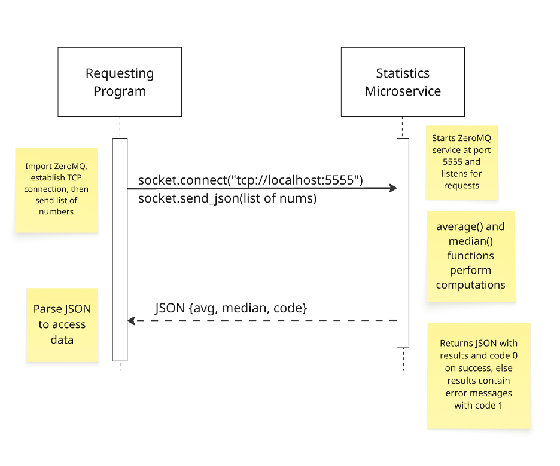

# Statistics Microservice

## Description
This microservice uses ZeroMQ to establish a server that can 
receive requests from clients.  In a request, it takes a list 
of numbers (int or float) and then computes the average and 
median of the set using separate functions.  On success, the 
results are stored in JSON format and transmitted with code
0 indicating success.  If the input is invalid and/or the 
computation was unable to be executed, an error message is 
returned in the response instead of the results with
code 1, indicating an error occurred.

The computed results are numbers rounded to two decimal places.

## How to REQUEST data
Install and import ZeroMQ (zmq), create socket, then establish TCP connection with the server.  
```
import zmq

context = zmq.Context()

socket = context.socket(zmq.REQ)
socket.connect("tcp://localhost:5555")
```
Send a list of numbers using JSON to encode the data.
```
socket.send_json(nums)
```

## How to RECEIVE data
Store the response in a variable and parse the JSON
```
response = socket.recv_json()
```
The response data can be accessed using the following keys: avg, median, code

If an error occurred, the error message will be the value instead 
of the computed result. 

See below an example of how the response data might be printed:
```
if response['code'] == 0:
    print(f"Average: {response['avg']}")
    print(f"Median: {response['median']}")
else:
    print(f"An error occurred:")
    print(f"Average: {response['avg']}")     # this may contain error msg
    print(f"Median: {response['median']}")   # this may contain error msg
```

## UML Diagram

